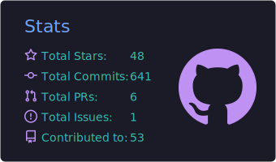
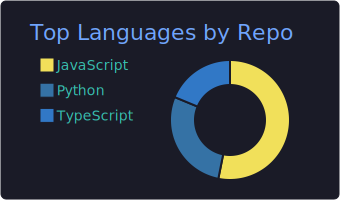
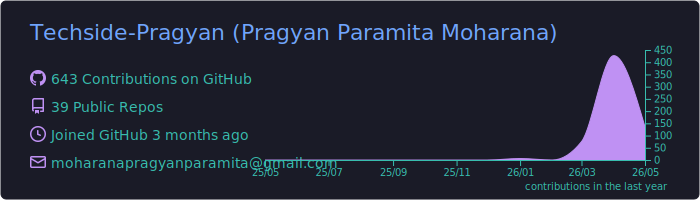
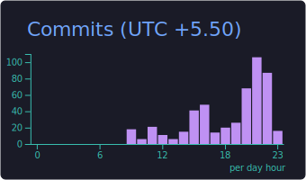
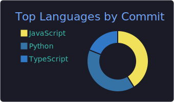
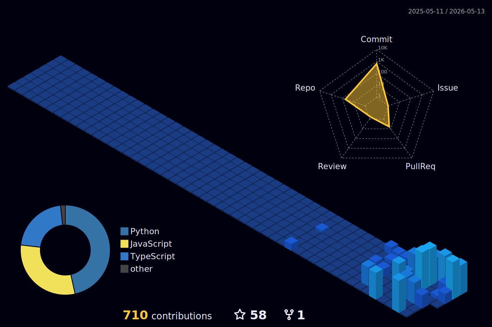

<div align="center">

<!-- Animated Header -->


<!-- Typing Animation -->
<a href="https://git.io/typing-svg"></a>

</div>

---

## 🧑‍💻 About Me

<table>
<tr>
<td width="55%">

```yaml
name: Pragyan Paramita Moharana
role: Computer Science & Engineering Student @ DRIEMS University
focus:
  - Artificial Intelligence & Machine Learning
  - Full-Stack Web Development (MERN Stack)
  - Cybersecurity
passion: Bridging innovative ideas with transformative technologies
goal: Creating efficient, scalable solutions that make a difference
currently_learning: Advanced AI/ML techniques, web development, cyber security & Cloud Technologies
fun_fact: I believe great code is like great poetry — elegant and expressive ✨
```

</td>
<td width="45%" align="center">


</td>
</tr>
</table>

<div align="center">

## 🌐 Connect With Me

[](https://www.linkedin.com/in/pragyan-paramita-moharana-303377377)
[](mailto:pragyanpramitamoharana@gmail.com)
[](https://github.com/Techside-Pragyan)

</div>

---

## 🛠️ Tech Stack & Tools


---

## 🎯 Currently Working On

```text
👩‍💻 GitHub Profile      ██████████████  100% - Perfected analytics and widgets
🌸 Flower Classifier    ████████████░░   90% - AI-powered image recognition
🌴 Tourix Platform      ██████████████  100% - Full-Stack Tourism & Booking
💄 Aura Cosmetics       ██████████████  100% - Next.js E-Commerce Application
```

---

## 📊 GitHub Analytics

<div align="center">
  
  
</div>

<div align="center">
  
</div>

> **Note:** The language chart above only reflects non-forked repositories. My full skill set includes **Python, Java, C, C++, PHP** and more — see the Tech Stack section above.

<!-- Activity Graph -->
<div align="center">
  
</div>

---

## 🏆 GitHub Trophies

<div align="center">
  
</div>

---

## 💻 My Coding Activity & Habits

<div align="center">
  
  
</div>

<div align="center">
  
</div>

---

## 📐 3D Perspective History

<div align="center">
  
</div>

---

## 📈 Contribution Calendar

<div align="center">
  <picture>
    <source media="(prefers-color-scheme: dark)" srcset="https://raw.githubusercontent.com/Techside-Pragyan/Techside-Pragyan/output/github-snake-dark.svg" />
    <source media="(prefers-color-scheme: light)" srcset="https://raw.githubusercontent.com/Techside-Pragyan/Techside-Pragyan/output/github-snake.svg" />
    
  </picture>
</div>

---

## 🔝 Top Repositories

<div align="center">

| 📦 Repository | 📝 Description | 🛠️ Tech |
|:---:|:---:|:---:|
| [**Tourix**](https://github.com/Techside-Pragyan/Tourix) | 🌴 Full-Stack Tourism & Booking Platform | `React` `Node.js` `MongoDB` `Express` |
| [**pragyan**](https://github.com/Techside-Pragyan/pragyan) | 👩‍💻 My GitHub Profile README | `Markdown` |
| [**skycast**](https://github.com/Techside-Pragyan/skycast) | 🌤️ Weather Forecasting App | `JavaScript` `API` |
| [**aura-cosmetics**](https://github.com/Techside-Pragyan/aura-cosmetics) | 💄 Cosmetics E-Commerce Platform | `Next.js` `TypeScript` `Tailwind` |
| [**Flower-Classification**](https://github.com/Techside-Pragyan/Flower-Classification) | 🌸 AI-Powered Flower Classifier | `Python` `ML` |

</div>

---

<div align="center">

### ✍️ Dev Quote of the Day


</div>

---

<div align="center">

### 🎵 Vibes

> *"The best way to predict the future is to create it."* — **Abraham Lincoln**


</div>


<!-- Profile Views Counter -->
<div align="center">
  


</div>
